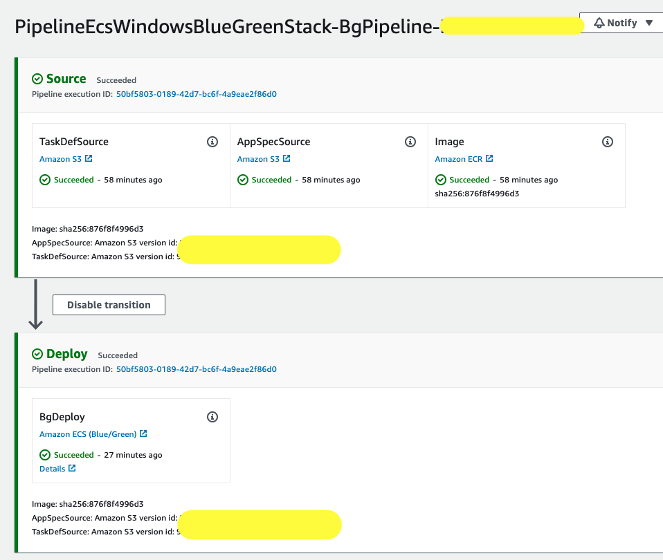

# Welcome to ecs-windows-ci-cd-blue-green project! 


This project sets up a Windows based ECS Cluster using [capacity provider auto-scaling](https://aws.amazon.com/blogs/containers/deep-dive-on-amazon-ecs-cluster-auto-scaling/) with fully automated Blue/Green deployment powered by AWS Code Deploy. All you 
need to pass is your ECR repo name where the image resides in [cdk.json](cdk.json) via `imageRepository` property.

It is assumed that you already have a mechanism in place to build and push your container image to ECR.
If you don't have the mechanism in place, Pipeline can easily be extended to introduce a code build stage to
build and deploy your container image. As part of demo setup, we have pushed [microsoft/iss](https://hub.docker.com/_/microsoft-windows-servercore-iis?tab=description) image from docker hub to ECR as per instructions [here](https://docs.aws.amazon.com/AmazonECS/latest/developerguide/windows_ecr.html).

The `cdk.json` file tells the CDK Toolkit how to execute your app.

It is a [Maven](https://maven.apache.org/) based project, so you can open this project with any Maven compatible Java IDE to build and run tests.

## Prerequisite

- Make sure you have [AWS CDK](https://docs.aws.amazon.com/cdk/latest/guide/getting_started.html) installed and configured with an aws account you want to use.
- Ensure you have [npm](https://www.npmjs.com/) installed.
- Ensure you have [java11](https://formulae.brew.sh/formula/openjdk@11) installed.

## Getting started

- Change to lambda directory and install needed dependencies by executing below command. 

    ```
      cd lambda
      npm install
      cd .. 
    ```
    **Note:** This is a one time activity to make sure the lambda function for custom resources has required dependencies.


- Build the maven project:

    ```
      mvn clean install
    ```

- Once the project is build successfully, Use CDK commands to diff and deploy the stacks. Application consists of two 
  stacks which needs to be deployed separately.
  
- **EcsWindowsBlueGreenClusterStack**: Sets up Windows based ECS Cluster with auto-scaling.
    It also sets up a service using CODE_DEPLOY as deployment controller backed by Network load balancer. It also sets up
      Code deploy application along with a Blue Green deployment group. Finally, It also copies taskdef.json
      and appspec.yaml files to S3 buckets as zip. This is need to set up Code Pipeline for ECS Blue Green deployment.

  ```
    cdk synth EcsWindowsBlueGreenClusterStack
  ```
  ```
    cdk deploy EcsWindowsBlueGreenClusterStack --require-approval never
  ```
      
    Once the stacks is deployed, you should be able to browse through the service following loadbalancer URL, which will 
    also be available in stack output as `LoadBalancerDnsName`.


- **PipelineEcsWindowsBlueGreenStack**: Sets up Code pipeline with ECS Blue Green Deployment. It uses S3 objects copied 
    as part of `EcsWindowsBlueGreenClusterStack` and an ECR repository as sources. You will need to pass the ECR repo name 
      where the image resides in [cdk.json](cdk.json) via `imageRepository` property.
  ```
    cdk synth PipelineEcsWindowsBlueGreenStack
  ```    
  ```
    cdk deploy PipelineEcsWindowsBlueGreenStack --require-approval never
  ```
  
    One the pipeline stack is deployed, a code pipeline is created. It will take care of Blue/Green Deployment for your 
    Ecs service using capacity provider autoscaling.
  

  

## Useful commands

 * `mvn package`     compile and run tests
 * `cdk ls`          list all stacks in the app
 * `cdk synth`       emits the synthesized CloudFormation template
 * `cdk deploy`      deploy this stack to your default AWS account/region
 * `cdk diff`        compare deployed stack with current state
 * `cdk docs`        open CDK documentation

Enjoy!
